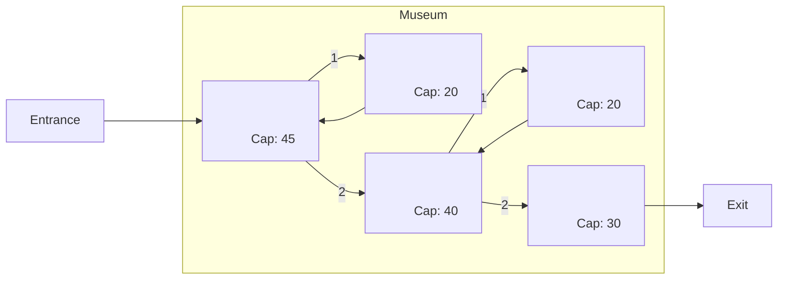

## **Systems Architecture**

# **Laboratory Session 12**

_Academic year 2023-2024_  
_Telematics Engineering Department - Universidad Carlos III de Madrid_

---

## PROBLEM 1 – Santa Claus in the North Pole
In this activity we will use semaphores as synchronization mechanism between threads. Download the file
[`NorthPole.java`][NorthPole_file] from [Aula Global][AG_folder], and change the code in order to fulfill the following.
In his workshop at the North Pole, Santa is sleeping in his office. He only can be disturbed if one of the following
two circumstances happens:

* When all the 9 reindeers return from their holidays, the last one should wake Santa. Meanwhile, the
remainder 8 reindeers should wait in their stable until the last reindeer returns and Santa is ready for
starting the distribution of toys around the Globe.
* When an elf has any difficulty with her/his work. In order to allow Santa to sleep, the elves can only
wake him when 3 of them have any problem. So, they should wait until there are 3 of them in the elves’
waiting room. Moreover, when the three elves go to Santa to ask their doubts, every other elf should
wait until the three of them return in front of the door of the elves’ waiting room.

If Santa awakes and finds 3 elves and the last reindeer, Santa will give priority to the reindeers (the elves can
wait until the end of Christmas) and he will go with the reindeers to distribute all the toys.

## PROBLEM 2 – The Museum
In this activity we will manage a museum with rooms of different capacity, using capacity and mutex
semaphores.

In a museum there is a synchronization problem. In the following [figure](museum_map.png) you can find the map of the museum,
the capacity of each room, and the route that the visitors should follow.

Download the file [`Museum.java`][Museum_file] from [Aula Global][AG_folder].

Compile the program and execute it. You will see how the system does not behave as expected. The semaphores
are initialized but we are not using them at all!

Modify `Museum.java`, in order to implement the specified system.

## PROBLEM 3 – Philosophers
Download the file [`Philosopher.java`][Philosopher_file], from [Aula Global][AG_folder].
Compile the program and execute it. You will see that no line is printed. There is a deadlock.
Modify `Philosopher.java`, in order to avoid the deadlock.

[AG_folder]: https://aulaglobal.uc3m.es/mod/folder/view.php?id=4772945
[NorthPole_file]: https://aulaglobal.uc3m.es/pluginfile.php/6750343/mod_folder/content/0/NorthPole.java?forcedownload=1
[Museum_file]: https://aulaglobal.uc3m.es/pluginfile.php/6750343/mod_folder/content/0/Museum.java?forcedownload=1
[Philosopher_file]: https://aulaglobal.uc3m.es/pluginfile.php/6750343/mod_folder/content/0/Philosopher.java?forcedownload=1
